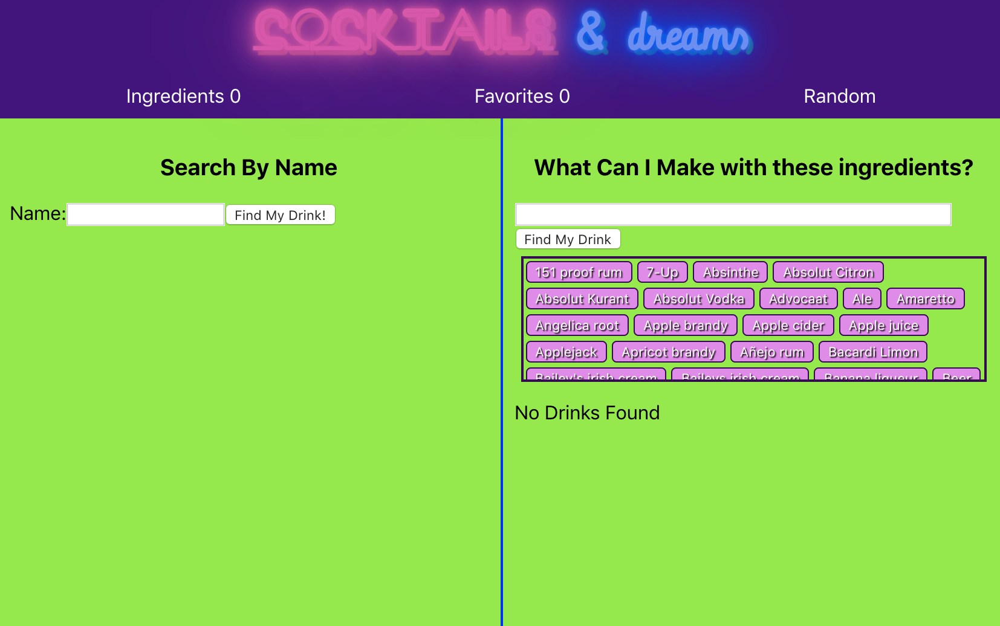

# Cocktails and Dreams

Created by Patrick Goulding using [The CocktailsDB API](https://www.thecocktaildb.com/api.php)

On the beginining screen you have two options, you can search for a drink by name, or you can select a drink by what ingredients you would like in it.

on the left simply enter the drink name you are thinking of, and press submit to see the drinks that match that name.

If you would like to search drinks by ingredient you can select the ingredients you would like your drink to have, and then it will show you the drink names that match.

Under ingredients you can add what ingredients you have at the house, see detailed dwscritions for each of those ingredients, and then anytime after you search for a drink it will show you what ingredients you have at your house and which ones you're still missing.

finally, if you want to throw caution ton the wind, you can select the random drink page where everytime you refresh, it updates to show you a new exciting drink you can make.

This project was bootstrapped with [Create React App](https://github.com/facebook/create-react-app).

## Available Scripts

In the project directory, you can run:

### `npm start`

Runs the app in the development mode. 
Open [http://localhost:3000](http://localhost:3000) to view it in the browser.

The page will reload if you make edits. 
You will also see any lint errors in the console.

### `npm test`

Launches the test runner in the interactive watch mode. 
See the section about [running tests](https://facebook.github.io/create-react-app/docs/running-tests) for more information.

### `npm run build`

Builds the app for production to the `build` folder. 
It correctly bundles React in production mode and optimizes the build for the best performance.

The build is minified and the filenames include the hashes. 
Your app is ready to be deployed!

See the section about [deployment](https://facebook.github.io/create-react-app/docs/deployment) for more information.

### `npm run eject`

**Note: this is a one-way operation. Once you `eject`, you can’t go back!**

If you aren’t satisfied with the build tool and configuration choices, you can `eject` at any time. This command will remove the single build dependency from your project.

Instead, it will copy all the configuration files and the transitive dependencies (Webpack, Babel, ESLint, etc) right into your project so you have full control over them. All of the commands except `eject` will still work, but they will point to the copied scripts so you can tweak them. At this point you’re on your own.

You don’t have to ever use `eject`. The curated feature set is suitable for small and middle deployments, and you shouldn’t feel obligated to use this feature. However we understand that this tool wouldn’t be useful if you couldn’t customize it when you are ready for it.

